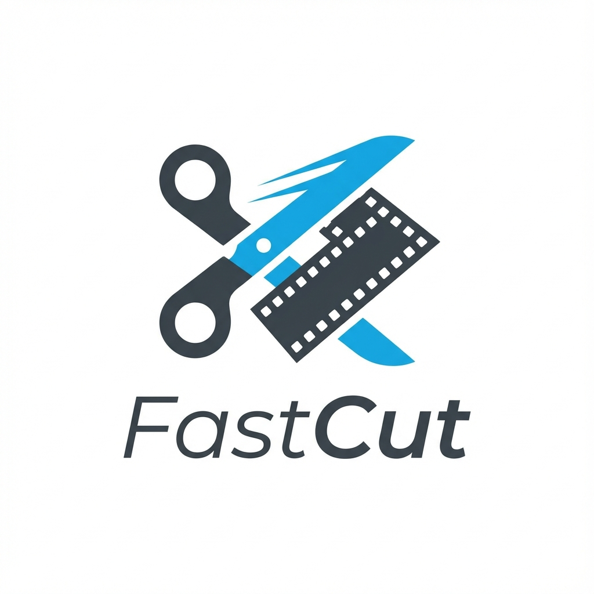

# FastCut

[](README_zh.md)

<p align="center">
  
</p>

FastCut is a lightweight and efficient video clipping tool designed for quick and precise video editing. It allows you to easily select start and end points, preview your selection, and export clips without re-encoding for maximum speed.

## Features

- **Efficient Workflow**:
  - **Keyboard Shortcuts**:
    - `C` - Set start point
    - `V` - Set end point
  - **Drag & Drop**: Easily load videos by dragging them into the window.
- **Precision & Control**:
  - **Preview**: Watch the selected range before exporting to ensure accuracy.
  - **Playback Controls**: Variable speed playback (0.25x - 3.0x) for detailed review.
- **High Performance**:
  - **Fast Export**: Uses FFmpeg for stream copying, ensuring no quality loss and instant exports.
  - **Smart Cut**: Optional keyframe-aligned cutting for faster processing.

## Downloads

We provide two types of releases:

- **Full Version (Recommended)**: Comes with FFmpeg bundled. No external dependencies required. Just download and run.
  - Filename: `FastCut-ffmpeg-embed-*.exe` (Windows) / `FastCut-ffmpeg-embed-*-osx` (macOS)
- **Lite Version**: Smaller size, but requires FFmpeg to be installed on your system.
  - Filename: `FastCut-*.exe` (Windows) / `FastCut-*-osx` (macOS)

## Requirements

- **Lite Version**: FFmpeg (must be in system PATH)
- **Source Code**: Python 3.10+, PyQt6

## Installation

1. **Install Python dependencies**:
   ```bash
   pip install -r requirements.txt
   ```

2. **Install FFmpeg**:
   - Download from [ffmpeg.org](https://ffmpeg.org/download.html)
   - Add the `bin` folder to your system PATH.

## Usage

1. **Run the application**:
   ```bash
   python main.py
   ```

2. **Load a video**: Drag & drop a file or click "Open File".
3. **Select a clip**:
   - Navigate to the start and press `C` (or click "Set Start").
   - Navigate to the end and press `V` (or click "Set End").
4. **Export**: Click "Export Clip" to save the video instantly.

## Configuration

- **Export Directory**: Change where clips are saved via `Settings` -> `Select Export Folder`.
- **Smart Cut**: Toggle keyframe alignment in `Settings`.
- **Playback Speed**: Your last used speed is saved automatically.

## License

MIT License
